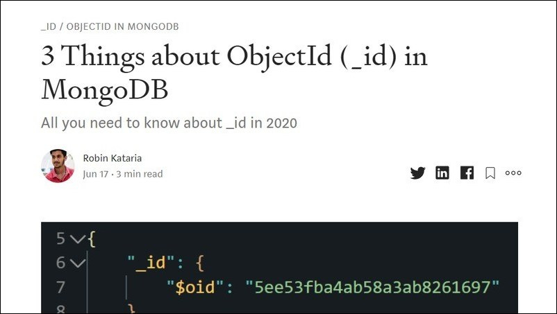
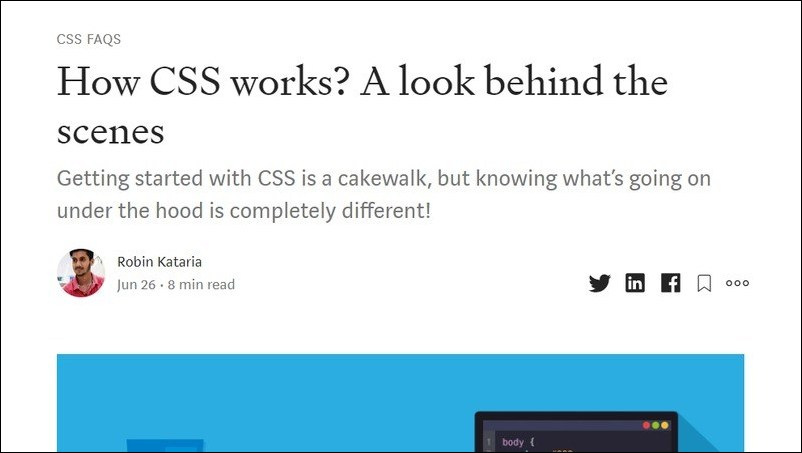

## Tech Blogs [Medium.com/@robinkataria](https://medium.com/@robinkataria)
> *Click on the Preview Image to read the article :)*

# (1) 3 Things about ObjectId (_id) in MongoDB
  

 

# (2) How CSS works? A look behind the scenes

